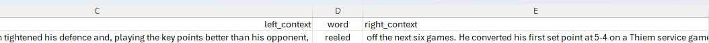

# Dev3

---
This document provides explanations of the provided files and guidelines for annotation.

**Goal**: Annotate usages for 100 randomly sampled words in total, assigning word senses (WSD-style) from the provided dictionary.
If a usage’s sense is not recorded in the dictionary yet do the same but update the dictionary with the unrecorded sense first.

This annotation will help development and evaluation of the **AUTODICT** project pipeline which takes a dictionary and usages of a target word, for which it tries to assign dictionary senses and detects unrecorded senses in the process.  Its purpose is to automate the process of keeping dictionaries up to date by collecting evidence for unrecorded senses and adding relevant ones.


## 📦 Content
- [📁 Folder Structure](#-folder-structure)
  - [🗃️️️ Overview](#-overview)
  - [📄 dict.tsv](#-dicttsv)
  - [📄 usage_sample.tsv](#-usage_sampletsv)
  - [📘 Examples](#-examples)
- [🖊️ How to annotate](#-how-to-annotate)
- [⚠️ Notes and Common Issues](#-notes-and-common-issues)


## 📁 Folder Structure

### 🗃️️ Overview
````
📁 your_annotation_data/
├── 📁 batch_10/
│   ├── 📁 in_ode/
│   │   ├── 📁 20/
│   │   │   ├── 📄 dict.tsv
│   │   │   ├── 📄 sense_id_mappings.tsv
│   │   │   └── 📄 usage_sample.tsv
│   │   ├── 📁 21/
│   │   │   ├── 📄 dict.tsv
│   │   │   ├── 📄 sense_id_mappings.tsv
│   │   │   └── 📄 usage_sample.tsv
│   ├── 📁 out_ode/
│   │   ├── 📁 20/
│   │   │   ├── 📄 dict.tsv
│   │   │   ├── 📄 sense_id_mappings.tsv
│   │   │   └── 📄 usage_sample.tsv
│   │   ├── 📁 21/
│   │   │   ├── 📄 dict.tsv
│   │   │   ├── 📄 sense_id_mappings.tsv
│   │   │   └── 📄 usage_sample.tsv
├── 📁 batch_11/
│   └── ...
└── ...
````

### 📄 dict.tsv

For each word in the respective folder there is a dictionary `.tsv` file containing different senses for that word.

**Important Columns**:

- `lemma` – The target word

- `sense_id` – Identifier for this sense, used in annotation of usages

- `sense_hierarchy` – POS + sense hierarchy (`noun:1`, `noun:1.1`). Use with caution.

- `definitions` – List of definitions for the sense

- `examples` – Example sentences for the sense. Use with caution

**Example Dictionary**:
````
lemma	sense_id	sense_hierarchy	definitions	examples	source
reel	1	noun:1	"[""a cylinder on which film, wire, thread, or other flexible materials can be wound""]"	"[""the wires may be rolled on to a simple reel"", ""the projectionist changed reels"", ""a cotton reel""]"	Lemur1000 ODENOAD Entries.xml
reel	2	noun:1.1	"[""a length of something wound on to a reel""]"	"[""a reel of copper wire""]"	Lemur1000 ODENOAD Entries.xml
reel	3	noun:1.2	"[""a device for winding and unwinding a line as required, in particular the line attached to a fishing rod""]"	[]	Lemur1000 ODENOAD Entries.xml
reel	4	noun:2	"[""a part or section of a film (originally the amount that could fit on one reel of film)""]"	"[""in the final reel he is transformed from unhinged sociopath into local hero""]"	Lemur1000 ODENOAD Entries.xml
reel	5	noun:3	"[""a collection of short videos or film clips, especially as shown on social media""]"	"[""the reel featured a compilation of her videos and pictures"", ""those goals are on the highlights reel for a reason"", ""Mira shared an Instagram reel that features herself""]"	Lemur1000 ODENOAD Entries.xml
reel	6	noun:4	"[""a lively Scottish or Irish folk dance""]"	"[""we put on the record player and danced reels"", ""an eightsome reel""]"	Lemur1000 ODENOAD Entries.xml
reel	7	noun:4.1	"[""a piece of music for a reel, typically in simple or duple time""]"	[]	Lemur1000 ODENOAD Entries.xml
reel	8	verb:1	"[""wind something on to a reel by turning the reel""]"	"[""sailplanes are often launched by means of a wire reeled in by a winch""]"	Lemur1000 ODENOAD Entries.xml
reel	9	verb:1.1	"[""bring in a fish attached to a line by turning a reel and winding in the line""]"	"[""he reeled in a good perch"", ""he struck, and reeled in a good perch""]"	Lemur1000 ODENOAD Entries.xml
reel	10	verb:2	"[""lose one's balance and stagger or lurch violently""]"	"[""he punched Connolly in the ear, sending him reeling"", ""Cormack reeled as the ship began to roll"", ""she reeled back against the van""]"	Lemur1000 ODENOAD Entries.xml
reel	11	verb:2.1	"[""walk in a staggering or lurching manner, especially while drunk""]"	"[""the two reeled out of the bar arm in arm""]"	Lemur1000 ODENOAD Entries.xml
reel	12	verb:2.2	"[""feel shocked, bewildered, or giddy""]"	"[""we are reeling from the response we've had"", ""the alcohol made my head reel"", ""the unaccustomed intake of alcohol made my head reel""]"	Lemur1000 ODENOAD Entries.xml
reel	13	verb:3	"[""dance a reel""]"	[]	Lemur1000 ODENOAD Entries.xml
reel	14	noun	"[""A short video on social media platforms. Originally proprietary of Instagram but increasingly used as a general term on other platforms, such as YouTube (whose version are properly called 'shorts').""]"	"[""(cf. REEL n. 7, the film sense from which this sense stems)""]"	Lemur1000

````

### 📄 usage_sample.tsv

For each headword in the respective folder there is a `.tsv` file containing either 30 (out_ode) or 100 (in_ode) sampled usages.

**Important Columns**:

- `sense_id` and `comment` – For annotation of the usages, see [🖊️ How to annotate](#-how-to-annotate)

- `left_context` `word` `right_context` – KWIC format (**K**ey **W**ord **I**n **C**ontext) splitting the usage in three parts with the target word at the center.

Make the `left_context` column right-aligned and the `word` center-aligned to properly read / annotate the usage:



In LibreOffice adjust additional cell settings for optimal visibility in ``format`` &#8594; ``cell``.

## 🖊️ How to annotate

### 0. Preparation

Before starting annotation make sure you understand all the files ([dict.tsv](#-dicttsv), [usage_sample.tsv](#-usage_sampletsv)), the following instructions and are aware of possible issues to look out for ([notes and common issues](#-notes-and-common-issues))

---
### 1. Pick a Batch to Annotate

One batch contains 2 "in_ode"-words with 100 usages each and 2 "out_ode"-words with 30 usages each. 
Time for annotation per batch ~ 4h

---
### 2. Pick Folder from the Batch to Annotate

e.g. ``batch_10/in_ode/20``, ``batch_10/in_ode/21``, ``batch_10/out_ode/20``, ``batch_10/out_ode/21``

---
### 3. Open the Dictionary File `dict.tsv`

Open the dictionary file and review all the senses listed for the word. If necessary do additional research using external sources to better understand.

---
### 4. Open the Usage Sample File `usage_sample.tsv`

---
### 5. Annotate:

For each usage:
- Carefully read and understand the usage
- Annotate the `sense_id` column according to the guidelines.:
  - If the usage matches a sense from the dictionary:
    - Annotate the matching `sense_id` from the dictionary (`1`, `2`, etc.)
    - For multiple applicable senses, list them separated by commas in order of relevance (e.g., "`2,4`").
  - If the usage does **not** match any existing dictionary sense:
    - Add the new sense to the dictionary file in a new row. Write a fitting sense definition and use negative sense IDs starting from `-1`, `-2`, and so forth.
    - Use these newly added senses in the annotation as usual. 
    - If the new sense is an idiom, use this format for the definition: `idiom "<IDIOM>": <DEFINITION>`. 
      For example: lemma: `kick the bucket` definition: "`idiom "kick the bucket": To die`". For a concrete example see [📘 Examples](#-examples)

  - Use `0` if you are unsure or do not understand the usage.
  - Use `x` for corrupted or unusable usages (e.g. missing target word)
  

- Optionally, add comments in the `comment` column. This is not mandatory.

##  📘 Examples

### Case: The usage matches one or more senses from the dictionary.

Annotate matching sense(s) from dictionary.


**example usages annotated**
````
sense_id	left_context	word	right_context
...
23	"At Westview Centre4Women, they've 	cracked	" the code on how to make it possible no matter where one lives.		
11,12	"These kids certainly want to get back and have another "	crack	" at it.
19,20,21	"Following BJP national president Amit Shah 	cracking	" the whip on the party's state unit for being lax on ...
...
````


**respective dictionary**
````
lemma	sense_id	sense_hierarchy	definitions	examples	source
crack	1	noun:1	"[""a line on the surface of something along which it has split without breaking apart""]"	"[""a hairline crack down the middle of the glass""]"	Lemur1000 ODENOAD Entries.xml
crack	2	noun:1.1	"[""a narrow space between two surfaces which have broken or been moved apart""]"	"[""he climbed into a crack between two rocks"", ""the door opened a tiny crack""]"	Lemur1000 ODENOAD Entries.xml
crack	3	noun:1.2	"[""a vulnerable point; a flaw""]"	"[""the company spotted a crack in their rival's defencesdefenses""]"	Lemur1000 ODENOAD Entries.xml
crack	4	noun:1.3	"[""the cleft between the buttocks""]"	"[""her hair came down to her bum crack"", ""your butt crack should not be visible when you squat"", ""I've got sand in my crack. I don't know how that's even possible""]"	Lemur1000 ODENOAD Entries.xml
crack	5	noun:2	"[""a sudden sharp or explosive noise""]"	"[""a loud crack of thunder""]"	Lemur1000 ODENOAD Entries.xml
crack	6	noun:2.1	"[""a sharp audible blow""]"	"[""she gave the thief a crack over the head with her rolling pin""]"	Lemur1000 ODENOAD Entries.xml
crack	7	noun:2.2	"[""a sudden harshness or change in pitch in a person's voice""]"	"[""the boy's voice had an uncertain crack in it""]"	Lemur1000 ODENOAD Entries.xml
crack	8	noun:3	"[""a joke, typically a critical or unkind one""]"	"[""he knew about the gossip and would make the odd crack""]"	Lemur1000 ODENOAD Entries.xml
crack	9	noun:4	"[""enjoyable social activity; a good time""]"	"[""he loved the crack, the laughing"", ""touring was good crack""]"	Lemur1000 ODENOAD Entries.xml
crack	10	noun:4.1	"[""a conversation""]"	"[""they are having a great crack about shooting""]"	Lemur1000 ODENOAD Entries.xml
crack	11	noun:5	"[""an attempt to achieve something""]"	"[""I fancy having a crack at winning a fourth title"", ""I thought I had a crack at winning""]"	Lemur1000 ODENOAD Entries.xml
crack	12	noun:5.1	"[""a chance to attack or compete with someone""]"	"[""he wanted to have a crack at the enemy""]"	Lemur1000 ODENOAD Entries.xml
crack	13	noun:6	"[""a potent hard crystalline form of cocaine broken into small pieces and inhaled or smoked""]"	"[""he uses crack and cocaine"", ""a crack dealer""]"	Lemur1000 ODENOAD Entries.xml
crack	14	verb:1	"[""break or cause to break without a complete separation of the parts""]"	"[""the ice all over the bog had cracked"", ""the ice all over the lake had cracked"", ""take care not to crack the glass"", ""a stone cracked the headlight glass on his car""]"	Lemur1000 ODENOAD Entries.xml
crack	15	verb:1.1	"[""break or cause to break open or apart""]"	"[""a chunk of the cliff had cracked off in a storm"", ""his face cracked into a smile"", ""she cracked an egg into the frying pan"", ""you can see how the landmasses have cracked up and moved around""]"	Lemur1000 ODENOAD Entries.xml
crack	16	verb:1.2	"[""break (wheat or corn) into coarse pieces""]"	[]	Lemur1000 ODENOAD Entries.xml
crack	17	verb:1.3	"[""open slightly""]"	"[""gingerly, he cracks open his door""]"	Lemur1000 ODENOAD Entries.xml
crack	18	verb:1.4	"[""give way or cause to give way under torture, pressure, or strain""]"	"[""the witnesses cracked and the truth came out"", ""no one can crack them—they believe their cover story"", ""no one can crack them—they believe their story""]"	Lemur1000 ODENOAD Entries.xml
crack	19	verb:2	"[""make or cause to make a sudden sharp or explosive sound""]"	"[""a shot cracked across the ridge"", ""he cracked his whip and galloped away""]"	Lemur1000 ODENOAD Entries.xml
crack	20	verb:2.1	"[""knock hard against something""]"	"[""she winced as her knees cracked against metal""]"	Lemur1000 ODENOAD Entries.xml
crack	21	verb:2.2	"[""hit (someone or something) hard""]"	"[""she cracked him across the forehead""]"	Lemur1000 ODENOAD Entries.xml
crack	22	verb:2.3	"[""(of a person's voice) suddenly change in pitch, especially through strain""]"	"[""‘I want to get away,’ she said, her voice cracking"", ""“I want to get away,” she said, her voice cracking""]"	Lemur1000 ODENOAD Entries.xml
crack	23	verb:3	"[""find a solution to; decipher or interpret""]"	"[""the code will help you crack the messages"", ""they have helped police crack a string of murder mysteries"", ""a hacker cracked the codes used in internet software""]"	Lemur1000 ODENOAD Entries.xml
crack	24	verb:3.1	"[""break into (a safe)""]"	[]	Lemur1000 ODENOAD Entries.xml
crack	25	verb:3.2	"[""succeed in achieving""]"	"[""he cracked a brilliant goal""]"	Lemur1000 ODENOAD Entries.xml
crack	26	verb:4	"[""tell (a joke)""]"	"[""he cracked jokes which she didn't find very funny""]"	Lemur1000 ODENOAD Entries.xml
crack	27	verb:5	"[""decompose (hydrocarbons) by heat and pressure with or without a catalyst to produce lighter hydrocarbons, especially in oil refining""]"	"[""catalytic cracking increases gasoline yields"", ""catalytic cracking""]"	Lemur1000 ODENOAD Entries.xml
crack	28	adjective:1	"[""very good or skilful""]"	"[""he is a crack shot"", ""crack troops""]"	Lemur1000 ODENOAD Entries.xml
crack	29	verb	"[""Convert paper money into smaller units""]"	"[""GDS: to change money, to break a note into change. 1927    [US]    T.A. Dorgan in Zwilling TAD Lex. (1993) 29: I cracked a $20 bill when I got into the game. 1944    [US]    D. Burley Orig. Hbk of Harlem Jive 83: Can you crack this cholly for me? Knock it out in a few double ruffs, a few sous and brownies. 1962    [UK]    C. Rohan Delinquents 5: He had to crack the pound to pay his fare. 1982        L. Block Eight Million Ways to Die 25: By then I had only one of the hundreds intact and I cracked that into tens and twenties. HDAS: to change (money); cash (a check). 1927 T.A. Dorgan Zwilling TAD Lexicon 29 I cracked a $20 bill when I got into the game.  1951 (DAS) Twenty bucks? Gee, I can't crack that.  1968 Spradley Drunk 30 I'll give you thirty the minute I crack a check. ""]"	Lemur1000
````

### Case: sense usage unrecorded in dictionary:
Update dictionary, adding the new sense with a new gloss using negative sense IDs. Then annotate usages accordingly


**example annotation of unrecorded sense usages**

```` 
sense_id	left_context	word	right_context
...
-1	So... I guess I'll find out in a week if it's what it's 	cracked	" up to be, if the' 90Mbps @ @ @ @ @ @ @ @ @ @ having to share (unlike...
-2	China's central bank has also urged banks to strengthen mortgage risk management, and 	crack	" down on market irregularities such as making...
...
````

**updated dictionary**

````
lemma	sense_id	sense_hierarchy	definitions	examples	source
...
crack	27	verb:5	"[""decompose (hydrocarbons) by heat and pressure with or without a catalyst to produce lighter hydrocarbons, especially in oil refining""]"	"[""catalytic cracking increases gasoline yields"", ""catalytic cracking""]"	Lemur1000 ODENOAD Entries.xml
crack	28	adjective:1	"[""very good or skilful""]"	"[""he is a crack shot"", ""crack troops""]"	Lemur1000 ODENOAD Entries.xml
crack	29	verb	"[""Convert paper money into smaller units""]"	"[""GDS: to change money, to break a note into change. 1927    [US]    T.A. Dorgan in Zwilling TAD Lex. (1993) 29: I cracked a $20 bill when I got into the game. 1944    [US]    D. Burley Orig. Hbk of Harlem Jive 83: Can you crack this cholly for me? Knock it out in a few double ruffs, a few sous and brownies. 1962    [UK]    C. Rohan Delinquents 5: He had to crack the pound to pay his fare. 1982        L. Block Eight Million Ways to Die 25: By then I had only one of the hundreds intact and I cracked that into tens and twenties. HDAS: to change (money); cash (a check). 1927 T.A. Dorgan Zwilling TAD Lexicon 29 I cracked a $20 bill when I got into the game.  1951 (DAS) Twenty bucks? Gee, I can't crack that.  1968 Spradley Drunk 30 I'll give you thirty the minute I crack a check. ""]"	Lemur1000
crack	-1		to be said to be something, either something good or something bad	to be cracked up to be something	
crack	-2		to start dealing with bad or illegal behaviour in a more severe way	Police organized operations to crack down in the area's most dangerous neighbourhoods.	
````
### Case: sense usage unrecorded in dictionary AND it is an idiom

**example annotation of unrecorded sense usages**

```` 
sense_id	left_context	word	right_context
...
-3	...and to avoid falling through the	cracks	said Alex Munter, president and CEO of...
...
````

**updated dictionary**

````
lemma	sense_id	sense_hierarchy	definitions	examples	source
...
crack	27	verb:5	"[""decompose (hydrocarbons) by heat and pressure with or without a catalyst to produce lighter hydrocarbons, especially in oil refining""]"	"[""catalytic cracking increases gasoline yields"", ""catalytic cracking""]"	Lemur1000 ODENOAD Entries.xml
crack	28	adjective:1	"[""very good or skilful""]"	"[""he is a crack shot"", ""crack troops""]"	Lemur1000 ODENOAD Entries.xml
crack	29	verb	"[""Convert paper money into smaller units""]"	"[""GDS: to change money, to break a note into change. 1927    [US]    T.A. Dorgan in Zwilling TAD Lex. (1993) 29: I cracked a $20 bill when I got into the game. 1944    [US]    D. Burley Orig. Hbk of Harlem Jive 83: Can you crack this cholly for me? Knock it out in a few double ruffs, a few sous and brownies. 1962    [UK]    C. Rohan Delinquents 5: He had to crack the pound to pay his fare. 1982        L. Block Eight Million Ways to Die 25: By then I had only one of the hundreds intact and I cracked that into tens and twenties. HDAS: to change (money); cash (a check). 1927 T.A. Dorgan Zwilling TAD Lexicon 29 I cracked a $20 bill when I got into the game.  1951 (DAS) Twenty bucks? Gee, I can't crack that.  1968 Spradley Drunk 30 I'll give you thirty the minute I crack a check. ""]"	Lemur1000
crack	-1		to be said to be something, either something good or something bad	to be cracked up to be something	
crack	-2		to start dealing with bad or illegal behaviour in a more severe way	Police organized operations to crack down in the area's most dangerous neighbourhoods.	
crack	-3		idiom "to fall through the cracks": to be overlooked	fatherless kids were not allowed to fall through the cracks	
````

## ⚠️ Notes and Common Issues

- Some programs may automatically modify certain values of the `.tsv` file (e.g., interpreting them as formulas). One way to avoid this is by setting the column type to text/string when opening the file.
- Different text encoding settings might cause character corruption, make sure this does not happen. Some artifacts are already present in the original files and not to be confused with encoding issues on your side.
- Ensure that the annotated file is saved in `.tsv` format again.
- We recommend using LibreOffice (Calc Spreadsheet)