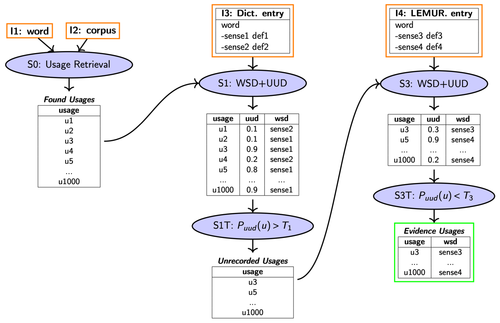

<div align="center">

# (Baseline) Pipeline

</div>


# README structure
- [📥 Prepare inputs](#-prepare-inputs)
  - [📑 Headwords files](#-headwords-files)
  - [📖 Dictionary files](#-dictionary-files)
  - [⚙️ Configuration Files](#-configuration-files)
- [🚀 Running the pipeline](#-running-the-pipeline)
- [📤 Outputs](#-outputs)
- [📈 Evaluation](#evaluation-)
- [🔍 Individual pipeline steps](#-individual-pipeline-steps)

> [!NOTE]
> Running some individual scripts or experiments may require adjusting hardcoded paths that are tied to our environment. This affects only a few usage extraction and sense definition generation scripts when they are run outside the pipeline context, as well as some experiment scripts and notebooks.
> The intended ways of running the pipeline, as described in this README, are not affected and run just fine as long as the configuration is complete and correct.


# 📥 Prepare inputs
## 📑 Headwords files
Headwords `.txt` files define a list of target headwords which will be given as input to the pipeline to extract usages from the NOW corpus and search them for corresponding LEMUR evidence.

Specify a list with at least one path to such files in your [configuration file](#-configuration-files) under `headword_files`, e.g. `headword_files=("headwords_example1.txt" "headwords_example2.txt")`

> [!IMPORTANT]
> Headwords must be separated by line breaks, so each line corresponds to a headword!


#### Example headwords file `headwords_example.txt`
```
apple
banana
cell
wagon
to come back to haunt somebody
```

## 📖 Dictionary files
The pipeline requires a dictionary .tsv file as input for both pipeline step S1 and pipeline step S3.

Specify a path to the files in your [configuration file](#-configuration-files) under `dictionary_s1` and `dictionary_s3`

#### Example dictionary file `dictionary_example.tsv`
| identifier | lemma | sense_id | gloss        |
|------------|-------|----------|--------------|
| entry_1    | arm   | arm_010  | a weapon     |
| entry_2    | arm   | arm_011  | a body part  |
| entry_3    | snake | snake_001 | an animal    |

If you have ODE `.xml` files or LEMUR `.csv` files, you can use [ode_to_dict.py](outlier2cluster/o2c/README.md#ode_to_dictpy) or [lemur_to_dict.py](outlier2cluster/o2c/README.md#lemur_to_dictpy) to convert them to this format.

> [!IMPORTANT]
> Make sure the identifiers are unique!

## ⚙️ Configuration Files
A configuration file contains parameters for pipeline execution and has to be specified when running the pipeline (see [Running the pipeline](#-running-the-pipeline)).

You can create your own configuration file following the structure described under [configuration structure](#configuration-structure) or use one of the default ones.

---
### Default configurations for pipeline run

[``config_trial1_skipS0.env``](config_trial1_skipS0.env)

Runs the pipeline on a small set of precomputed usages, skips S0

[``dev3_annotation.env``](dev3_annotation.env)

Runs the pipeline on the dev3 dataset for which annotations exist

[``dev3_annotation_LFS.env``](dev3_annotation_LFS.env)

Runs the pipeline on the modified version of dev3 dataset which use the **L**east **F**requent unrecorded **S**ense as LEMUR replacement for each target word (**LFS**)

[``dev3_annotation_MFS.env``](dev3_annotation_MFS.env)

Runs the pipeline on the modified version of dev3 dataset which use the **M**ost **F**requent unrecorded **S**ense as LEMUR replacement for each target word (**MFS**)

### Default configurations for executing individual pipeline steps

Use these configurations with the respective bash scripts to run the individual pipeline steps. By default, execution using these configuration files in order equals the execution of entire pipeline on headwords of development set dev1. 
Configuration files can be modified to meet your requirements.

[``ue_s0.env``](ue_s0.env): configuration for ue.sh 

Run ue.sh bash script with this configuration to only execute pipeline step S0 using the usage-extract script.

Use like this: ``bash ue.sh ue_s0.env ``

[``o2c_s1.env``](o2c_s1.env): configuration for o2c.sh 

Run o2c.sh bash script with this configuration to only execute pipeline step S1 using the outlier2cluster script.

Use like this: ``bash o2c.sh o2c_s1.env ``

[``o2c_s3.env``](o2c_s3.env): configuration for o2c.sh 

Run o2c.sh bash script with this configuration to only execute pipeline step S3 using the outlier2cluster script.

Use like this: ``bash o2c.sh o2c_s3.env ``

[``sdg_s2.env``](sdg_s2.env): configuration for sdg.sh 

Run sdg.sh bash script with this configuration to only execute pipeline step S2 using the sense_definition_generation script.

Use like this: ``bash sdg.sh sdg_s2.env ``

---

### configuration structure

| **Section**                        | **Variable**          | **Description**                                                                              |
| ---------------------------------- | --------------------- |----------------------------------------------------------------------------------------------|
| **General**                        | `result_dir`          | Directory where all results will be written to                                               |
|                                    |                       |                                                                                              |
| **S0: Usage Extraction**           | `headword_files`      | List of paths to [headword files](#-headwords-files) containing target headwords             |
|                                    | `corpus_path`         | Path to the NOW corpus (wlp folder).                                                         |
|                                    | `sources_path`        | Path to the NOW corpus `sources.tar`.                                                        |
|                                    | `corpus_filter`       | Glob pattern or file name specifying the NOW corpus files to be used for usage extraction    |
|                                    | `total_usage_limit`   | Maximum number of usages to extract per headword. Useful to limit usages for frequent words  |
|                                    | `context_range`       | Context before and after headword in usage (in tokens)                                       |
|                                    | `random_state`        | Random seed for shuffling usages before applying ``total_usage_limit``                       |
|                                    |                       |                                                                                              |
| **S1: Unrecorded Usage Detection** | `dictionary_s1`       | Path to the input dictionary for S1 (e.g ODE)                                                |
|                                    | `threshold_s1`        | Threshold applied to unrecorded-probability to classify recorded/unrecorded in S1            |
|                                    | `model_weights_s1`    | Path to NSD [model weights](outlier2cluster/o2c/data/models/NSD) (`.pkl`) for S1 predictions |
|                                    | `max_usage_length_s1` | Maximum usage length given to the model in S1, does not modify the usage in the output       |
|                                    |                       |                                                                                              |
| **S3: Find Lemur Evidence**        | `dictionary_s3`       | Path to the input dictionary for S3 (e.g. LEMUR)                                             |
|                                    | `threshold_s3`        | Threshold applied to unrecorded-probability to classify recorded/unrecorded in S3            |
|                                    | `model_weights_s3`    | Path to NSD [model weights](outlier2cluster/o2c/data/models/NSD) for S3 predictions          |
|                                    | `max_usage_length_s3` | Maximum usage length given to the model in S3, does not modify the usage in the output       |


# 🚀 Running the pipeline

To run the pipeline, execute the pipeline script and specify a configuration file. E.g.:

```bash pipeline.sh dev3_annotation.env```

To execute the pipeline steps individually you can use

``bash ue.sh ue_s0.env``

``bash o2c.sh o2c_s1.env``

``bash o2c.sh o2c_s3.env``

``bash sdg.sh sdg_s2.env``

Before running the scripts make sure the environment and required dependencies are set up as described in the root [README](../README.md#-installation)

# 📤 Outputs
In your specified result directory you will find these pipeline outputs:

```
result_dir/
├── extracted_usages/
├── s1/
├── s3/
├── sdg/
├── evidence.tsv
├── usage_counts.tsv
```
---

`/extracted_usages`

Contains all the usages extracted by S0 for the specified target headwords. `/extracted_usages/info.tsv` contains basic information such paths to the extracted usages for each headword and the number of retrieved usages.

---
`/s1` and `/s3`

Contains outputs of the pipeline steps S1 and S3:

| Filename              | Description                                                                           |
|-----------------------|---------------------------------------------------------------------------------------|
| configuration.tsv     | Most important parameters used in the execution like threshold values and input files |
| nsd_weights.tsv       | NSD model weights used to compute recorded/unrecorded probabilities                   |
| results_raw           | Complete output file containing all recorded and unrecorded usages                    |
| recorded.tsv          | Usages classified as **recorded** after thresholding                                  |
| unrecorded.tsv        | Usages classified as **unrecorded** after thresholding                                |
| wsd.tsv               | Word Sense Disambiguation (WSD) results for all input usages                          |
| wsi.tsv               | Word Sense Induction (WSI) results for all input usages                               |
| prob_distribution.png | Visualization of the predicted probability distribution                       |

---
`/sdg`

Contains generated sense definitions for seses that remained unrecorded till the very end (did not match any sense of provided directories in S1 or S3)

---
`evidence.tsv`

Basic information about LEMUR evidence such as number of evidence usages found and percentage of total usages

---
`usage_counts.tsv`

Basic information about the number of usages for each headword throughout the pipeline.

# 📈 Evaluation

### Run the pipeline
First produce pipeline results using the usages from our dev3 annotation at [../data/dev3/raw_usages](../data/dev3/raw_usages).
For this specify `s0_precomputed="../data/dev3/raw_usages"` in the config file you use. You can use the LEMUR dictionary at [../data/dev3/dictionaries/lemur_dictionary.tsv](../data/dev3/dictionaries/lemur_dictionary.tsv) and the ODE dictionary at [../data/dev3/dictionaries/ode_dictionary.tsv](../data/dev3/dictionaries/ode_dictionary.tsv) specifically for the dev3 dataset.

Instead of creating your own configuration file you can just modify and use the configuration file `dev3_annotation.env` where these paths are already set.

E.g. run:
```
bash pipeline.sh dev3_annotation.env
```

### Evaluate Results

Use the script `evaluate_dev3.py` to evaluate these results.

Required parameters:

| parameter | Description                                                                                                    | type  | example |
|-----------|----------------------------------------------------------------------------------------------------------------|----|---------|
| --result_dir  | Path to the result directory produced by pipeline.sh, containing  `s1/result_raw.tsv` and `s3/result_raw.tsv`. | str | "data/results_dev3_annotations"|
Optional parameters:

| parameter    | Description                                                                                                                 | type | example |
|--------------|-----------------------------------------------------------------------------------------------------------------------------|------|---------|
| --out_dir | Path to a output directory. If not specified the output files are saved to current working directory.                       | str  | "my_eval_results"|
| --config     | Path to the configuration file that was used to produce the results. If specified add parameters to the output file.        | str  | "dev3_annotation.env"|
| --name | Name to save the results under. Use either configuration name if specified or default name with timestamp if not specified. | str  | "my_pipeline_run"|
| --leaderboard | When this flag is set, results are appended to the `data/leaderboard.tsv` file where results can be collected and compared. | flag | "data/results_dev3_annotations"|

E.g.:
```
python evaluate_dev3.py --result_dir "data/results_dev3_annotations"
```
Or
```
python evaluate_dev3.py --result_dir "data/results_dev3_annotations" --out_dir "my_eval_results" --config "dev3_annotation.env" --name "my_pipeline_run" --leaderboard
```
---

In the output directory you will find:

```
output_directory/
├── eval.tsv  # tsv file with precision and recall results
├── pr-table.tsv  # tsv table with precision and recall results for each word individually
```


# 🔍 Individual pipeline steps
For more detailed explanations of a specific step, see the corresponding README.
- S0: [Usage Retrieval from NOW Corpus](usage-extract/README.md)
- S1/S3: [Outlier2Cluster](outlier2cluster/o2c/README.md)
- S2: [Gloss Generation](sense_definition_generation/README.md)

## S1 and S3: UUD and WSD
Both parts use the same [script](outlier2cluster/o2c/README.md#31-mainpy) to compare target word usages against a reference dictionary and label the usage's word sense as recorded/unrecorded (**U**nrecorded **U**sage **D**etetction). 
Recorded senses are labeled with their matching dictionary sense ID (**W**ord **S**ense **D**isambiguation) and unrecorded senses with a cluster ID (**W**ord **S**ense **D**isambiguation), grouping them into clusters.

In context of this project, S1 takes the existing ODE dictionary senses as input and all extracted usages for the target words. 
S3 continues with the target word usages labeled as unrecorded compared to the ODE dictionary in S1 and compares them against the LEMUR sense proposals. 
Target word usages labeled as recorded in S3 are evidence for their assigned LEMUR sense proposal.

### Inputs
Requires a dictionary TSV file containing word sense information and at least one TSV file containing respective word usages.

#### Dictionary input format
| identifier | lemma | sense_id | gloss        |
|------------|-------|----------|--------------|
| entry_1    | arm   | arm_010  | a weapon     |
| entry_2    | arm   | arm_011  | a body part  |
| entry_3    | snake | snake_001 | an animal   |

#### Usages input format
| identifier   | lemma | context                                        | indexes_target_token |
|--------------|-------|------------------------------------------------|----------------------|
| usage_1      | arm   | They smuggled arms across the border at night. | 14:18                |
| usage_2      | arm   | He broke his arm playing football.             | 13:16                |
| usage_3      | arm   | The rebels stockpiled arms in hidden bunkers.  | 22:26                |
| usage_4      | snake | A snake slithered across the path.             | 2:7                  |

### Outputs
The script produces the following output files:

| Filename            | Description                                                                           |
|---------------------|---------------------------------------------------------------------------------------|
| configuration.tsv   | Most important parameters used in the execution like threshold values and input files |
| nsd_weights.tsv     | NSD model weights used to compute recorded/unrecorded probabilities                   |
| results_raw         | Complete output file containing all recorded and unrecorded usages                    |
| recorded.tsv        | Usages classified as **recorded** after thresholding                                  |
| unrecorded.tsv      | Usages classified as **unrecorded** after thresholding                                |
| wsd.tsv             | Word Sense Disambiguation (WSD) results for all input usages                          |
| wsi.tsv             | Word Sense Induction (WSI) results for all input usages                               |

For more details check the [README](outlier2cluster/o2c/README.md) for this specific pipeline step.

## S2: Sense Definition Generation
[README](sense_definition_generation/sdg2/README.md)
This part of the pipeline explores **Sense Definition Generation** using large language models (LLMs).
Often, dictionary candidates are missing good and understandable definitions.

The goal of this scripts is to generate improved/alternative definitions for word senses using context sentences and existing definitions from **LEMUR**. This way, we can create better definitions for suggested new entries and also help with **Word Sense Disambiguation (WSD)**.

This part of the pipeline automatically:
- loads existing LEMUR definitions,
- combines them with example usages,
- prompts an LLM to generate new definitions,
- and selects the most appropriate one.

### Example Definitions
#### LEMUR definition
> A foolish person; a person mocked as having an undersized brain.

#### LLM-chosen best generated definition
> A foolish person; a person mocked as having an undersized brain.
